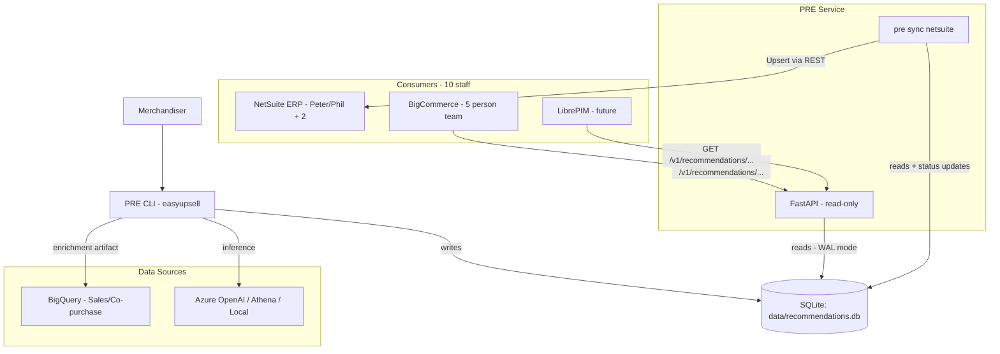

# Phase 4 SDD v1.2 — PRE Service Layer
## SQLite Canonical Store · Read-Only API · NetSuite Upsert Sync

**Status:** Draft (Enterprise Production Grade)
**Date:** 2026-02-16
**Author:** David Carroll — synthesized from Antigravity draft, Otto v1.0 rewrite, and DC v1.1 dialectical revision
**Audience:** DC (IT Director), Peter Cler & Phil (NetSuite Architects), BigCommerce team (5), implementing agents

---

## 0. Change Log

| Version | Date | Author | Summary |
|---------|------|--------|---------|
| v0.9 | 2026-02-16 | Antigravity (Opus 4.6 + Gemini Pro) | Initial draft. Architecture sections sound; implementation plan underspecified. API response schema contradicted DB schema. |
| v1.0 | 2026-02-16 | Otto (Claude Opus 4.6) | Full rewrite grounded in actual codebase. Fixed data contract, added risk register, deferred package rename, hardened NS sync spec. |
| v1.1 | 2026-02-16 | DC + Copilot | Dialectical revision. Added authoritative DDL with UNIQUE constraint, per-request throttling, margin unit standardization, structured error contracts, dead-letter reporting, env-only secrets, PR guardrail checklist. |
| **v1.2** | **2026-02-16** | **DC + Otto** | **Merge of v1.0 codebase grounding + v1.1 enterprise rigor. Added: rollback procedures, capacity planning, runbook, monitoring alerts, team RACI, data integrity verification, NS sandbox validation gate.** |

---

## 1. Executive Summary

Phase 4 transforms EasyUpsell from a CLI-only proof-of-concept into **PRE (Product Recommendation Engine)** — a production service that downstream systems (NetSuite, LibrePIM, BigCommerce) query for structured recommendation data. This is the transition from "impressive demo" to "system that people's jobs depend on."

**Deliverables:**

1. **Recommendation Database** — Promote current CSV/Excel output into a SQLite database with a formal schema, constraints, and integrity guarantees. This becomes the **single source of truth** for all recommendation data across the organization.
2. **REST API** — Lightweight FastAPI **read-only** service for external consumption by BigCommerce (5-person team) and future LibrePIM integration.
3. **NetSuite Sync** — Batch job that pushes approved recommendations into a NetSuite custom record type via REST API upsert, making PRE data native to the ERP for the 4-person NS team.

**Design Philosophy:**
- CLI remains the **write interface** (analyze, review, approve). Merchandisers interact here.
- API is **read-only**. BigCommerce and LibrePIM consume here.
- NetSuite sync is a **one-way push** from SQLite → NS. No bidirectional sync.
- No event-driven pipeline in Phase 4. Batch is correct for this volume and team size.
- **Package rename** (`easyupsell` → `pre`) is deferred to Phase 5 to avoid import churn during a high-stakes delivery.

**Success Criteria:**
- Recommendations queryable via API with <200ms p95 latency
- Nightly NS sync completes within 4-hour maintenance window
- Zero data loss during sync failures (dead-letter capture)
- All 10 downstream staff can self-service debug via structured logs and JSONL reports

---

## 2. Architecture

### 2.1 System Context



### 2.2 Current Component Inventory

| Component | Location | Status | Phase 4 Work | Owner |
|-----------|----------|--------|--------------|-------|
| CLI entry point | `easyupsell/cli.py` | ✅ Stable | Add `serve` and `sync` commands | DC |
| Analysis engine | `easyupsell/core/analyzer.py` | ✅ Stable | Wire output to SQLite (dual-write CSV + DB during transition) | DC |
| Review engine | `easyupsell/core/review.py` | ✅ Stable | Wire status updates to SQLite | DC |
| BigQuery client | `src/bigquery_client.py` | ✅ Stable | No changes | — |
| Enrichment service | `src/enrichment.py` | ✅ Stable | No changes | — |
| NetSuite client | `src/netsuite/client.py` | ⚠️ Read-only | **Extend with upsert/create** | DC, validated by Peter |
| NetSuite auth | `src/netsuite/auth.py` | ✅ Stable (HMAC-SHA256 TBA) | Verify role permissions for custom record writes | Peter |
| BigCommerce client | `src/bigcommerce/client.py` | ✅ Has write ops | Defer `sync bigcommerce` to Phase 5 | BC team |
| TTL cache | `src/cache.py` | ✅ Stable | No changes (separate concern from recommendation DB) | — |
| Store context | `src/context.py` | ✅ Stable | No changes | — |
| **NEW:** Recommendation DB | `src/db.py` | ❌ | **Create** | DC |
| **NEW:** REST API | `src/api.py` | ❌ | **Create** | DC |
| **NEW:** NS sync job | `src/sync/netsuite.py` | ❌ | **Create** | DC, validated by Peter/Phil |

### 2.3 What Does NOT Change (Phase 4 Guardrails)

- **No package rename** (`easyupsell` → `pre`) in Phase 4. The CLI already displays as `pre` in help text. Rename is Phase 5.
- **CSV/Excel export continues** during transition. The analyzer dual-writes to both CSV and SQLite until the team confirms DB-only is safe. Kill the CSV path in Phase 5.
- **No changes to the analysis or review logic** — Phase 4 is purely about the persistence and distribution layer.
- **No changes to LLM provider configuration** — the existing multi-provider setup (Azure, Athena, local, Ollama, LiteLLM) is untouched.

### 2.4 RACI Matrix

| Activity | DC | Peter/Phil | BC Team |
|----------|-----|-----------|---------|
| DB schema design & implementation | **R/A** | C | I |
| API design & implementation | **R/A** | I | C |
| NS custom record creation | C | **R/A** | — |
| NS sync job implementation | **R/A** | C | — |
| NS role permission grant | I | **R/A** | — |
| API consumer integration | C | — | **R/A** |
| Acceptance testing | **R/A** | **R** | **R** |
| Production deployment | **R/A** | C | I |

R=Responsible, A=Accountable, C=Consulted, I=Informed

---

## 3. Data Design

### 3.1 SQLite Recommendation Database

**DB file:** `data/recommendations.db` (alongside existing `data/cache.db`)

**Role:** Canonical store. SQLite replaces CSV/Excel as the authoritative source of truth for all recommendation data. All downstream systems (API, NS sync, future BC sync) read from this database exclusively.

#### 3.1.1 Connection Contract (mandatory PRAGMAs)

Every SQLite connection opened by any component **MUST** apply these PRAGMAs before any query:

```python
def _apply_pragmas(conn: sqlite3.Connection, read_only: bool = False) -> None:
    """Mandatory connection setup. Called on EVERY connection."""
    conn.execute("PRAGMA journal_mode=WAL;")        # concurrent readers + single writer
    conn.execute("PRAGMA synchronous=NORMAL;")       # safe with WAL, 10x faster than FULL
    conn.execute("PRAGMA foreign_keys=ON;")          # enforce referential integrity
    conn.execute("PRAGMA busy_timeout=5000;")        # 5s wait before SQLITE_BUSY (API under load)
```

**API connections MUST be read-only** by opening via URI mode: `sqlite3.connect(f"file:{db_path}?mode=ro", uri=True)`. This is a safety net — if a bug in the API layer attempts a write, SQLite raises an error instead of silently corrupting data.

**Why these specific PRAGMAs:**
- `WAL` — allows the FastAPI workers (multiple readers) to operate concurrently with CLI writes. Without WAL, readers block on writes and vice versa.
- `busy_timeout=5000` — under concurrent API load, a reader may briefly wait for the WAL checkpoint. 5 seconds prevents spurious `SQLITE_BUSY` errors without masking real deadlocks.
- `synchronous=NORMAL` — with WAL mode, NORMAL provides crash safety (committed transactions survive power loss) at ~10x the throughput of FULL. The only risk is losing the most recent uncommitted transaction on OS crash, which is acceptable.

#### 3.1.2 Authoritative Schema (SQL DDL)

> **This DDL is the source of truth.** Implementation MUST execute this verbatim. Tests MUST verify the schema matches.

```sql
-- ==========================================================================
-- PRE Recommendation Database Schema
-- Version: 1.2 (Phase 4 SDD)
-- ==========================================================================

CREATE TABLE IF NOT EXISTS recommendations (
    id                INTEGER PRIMARY KEY AUTOINCREMENT,

    -- Lookup keys
    source_category   TEXT    NOT NULL,
    source_sku        TEXT    NULL,           -- NULL for category→item recs; populated in Phase 6 (item→item)

    target_sku        TEXT    NOT NULL,
    target_netsuite_id TEXT   NULL,           -- Extracted from BC bin_picking_number. NULL = orphan (see §5.5)

    -- Display / hydration fields (stored at write-time, no live lookups at API-time)
    target_name       TEXT    NOT NULL,
    target_price      REAL    NULL,           -- From BigCommerce product price at analysis time

    -- Model outputs
    score             REAL    NOT NULL CHECK(score >= 0.0 AND score <= 1.0),
    reasoning         TEXT    NULL,           -- LLM explanation
    relationship_type TEXT    NULL,           -- 'accessory', 'cross_sell', 'up_sell', 'complement'

    -- Human workflow
    status            TEXT    NOT NULL DEFAULT 'pending_review'
                      CHECK(status IN ('pending_review', 'active', 'rejected')),

    -- Enrichment snapshots (from BigQuery, stored at write-time)
    copurchase_count  INTEGER NOT NULL DEFAULT 0,
    margin            REAL    NOT NULL DEFAULT 0.0,   -- FRACTION (0.42 = 42%). Convert to % at NS boundary ONLY.
    velocity          REAL    NOT NULL DEFAULT 0.0,   -- Units sold in 90-day window

    -- NetSuite sync bookkeeping
    ns_sync_status    TEXT    NOT NULL DEFAULT 'pending'
                      CHECK(ns_sync_status IN ('pending', 'synced', 'failed')),
    ns_sync_at        TEXT    NULL,           -- ISO 8601 UTC timestamp of last successful push
    ns_sync_error     TEXT    NULL,           -- Last error message (NULL on success)

    -- Timestamps
    created_at        TEXT    NOT NULL DEFAULT (CURRENT_TIMESTAMP),
    updated_at        TEXT    NOT NULL DEFAULT (CURRENT_TIMESTAMP),

    -- CRITICAL: This constraint enables correct upsert behavior.
    -- Without it, INSERT ON CONFLICT has nothing to conflict on → silent duplicates.
    UNIQUE(source_category, target_sku)
);

-- Indexes: tuned for the three primary access patterns
CREATE INDEX IF NOT EXISTS idx_target_sku           ON recommendations(target_sku);
CREATE INDEX IF NOT EXISTS idx_target_netsuite_id   ON recommendations(target_netsuite_id);
CREATE INDEX IF NOT EXISTS idx_source_category      ON recommendations(source_category);
CREATE INDEX IF NOT EXISTS idx_status               ON recommendations(status);
CREATE INDEX IF NOT EXISTS idx_ns_sync              ON recommendations(status, ns_sync_status);

-- updated_at maintenance: trigger fires on every UPDATE
CREATE TRIGGER IF NOT EXISTS trg_recommendations_updated_at
AFTER UPDATE ON recommendations
FOR EACH ROW
BEGIN
    UPDATE recommendations SET updated_at = CURRENT_TIMESTAMP WHERE id = OLD.id;
END;
```

#### 3.1.3 Upsert Contract

All writes MUST use the unique constraint for idempotent upserts:

```sql
INSERT INTO recommendations (source_category, target_sku, target_name, score, ...)
VALUES (?, ?, ?, ?, ...)
ON CONFLICT(source_category, target_sku) DO UPDATE SET
    target_name = excluded.target_name,
    target_price = excluded.target_price,
    score = excluded.score,
    reasoning = excluded.reasoning,
    relationship_type = excluded.relationship_type,
    copurchase_count = excluded.copurchase_count,
    margin = excluded.margin,
    velocity = excluded.velocity,
    ns_sync_status = CASE
        WHEN excluded.score != recommendations.score
          OR excluded.status != recommendations.status
        THEN 'pending'        -- re-sync if material fields changed
        ELSE recommendations.ns_sync_status
    END;
```

**Key behavior:** When a recommendation is re-analyzed and the score or status changes, `ns_sync_status` resets to `pending` so the next sync picks it up. If only non-material fields change (e.g., reasoning text), the sync status is preserved to avoid unnecessary NS API calls.

#### 3.1.4 Query Contracts

| Consumer | Query | Filter |
|----------|-------|--------|
| API (all endpoints) | Read recommendations | `status = 'active'` only. Never expose pending/rejected to external consumers. |
| NS sync job | Read for push | `status = 'active' AND ns_sync_status IN ('pending', 'failed')` unless `--force` |
| CLI status command | Summary stats | `GROUP BY status, ns_sync_status` |
| Migration script | Bulk insert | Direct upsert, no filters |

#### 3.1.5 Capacity Estimate

Current data volume: ~8,346 category-level recommendations + ~8,067 dark horse pairings = ~16,400 rows. Even at 10x growth (164,000 rows), SQLite handles this trivially — the entire DB fits in RAM. WAL mode checkpoint is sub-millisecond at this scale.

**When to graduate to Postgres:** If PRE ever needs multi-writer (multiple services writing concurrently), multi-node deployment, or row-level security. None of these are on the Phase 4-6 horizon.

---

### 3.2 NetSuite Custom Record

**Record Type ID:** `customrecord_wpsg_pre_rec`
**External ID Field:** `custrecord_pre_external_id` (Free-Form Text, unique)
**External ID Value:** `{source_category}::{target_sku}` — delimiter `::` is safe (no WPSG category names or SKUs contain double-colons; verified against current catalog)

#### 3.2.1 Field Mapping

| NetSuite Field ID | Label | NS Type | SQLite Source | Transform |
|-------------------|-------|---------|---------------|-----------|
| `custrecord_pre_external_id` | External ID | Free-Form Text | `source_category` + `target_sku` | `f"{source_category}::{target_sku}"` |
| `custrecord_pre_source_cat` | Source Category | Free-Form Text | `source_category` | Direct |
| `custrecord_pre_target_item` | Target Item | List/Record (Item) | `target_netsuite_id` | `{"id": str(target_netsuite_id)}` |
| `custrecord_pre_score` | Confidence Score | Decimal Number | `score` | Direct (0.00–1.00) |
| `custrecord_pre_reason` | Reasoning | Free-Form Text | `reasoning` | Direct (truncate to 4000 chars — NS free-form limit) |
| `custrecord_pre_type` | Relationship Type | List (Custom) | `relationship_type` | `{"value": relationship_type}` |
| `custrecord_pre_active` | Active | Checkbox | `status` | `status == 'active'` → `true` |
| `custrecord_pre_margin` | Margin % | Percent | `margin` | **`margin * 100`** (DB stores fraction, NS expects percent) |
| `custrecord_pre_velocity` | 90-Day Velocity | Integer | `velocity` | `int(velocity)` |
| `custrecord_pre_synced_at` | Last Synced | Date/Time | sync timestamp | ISO 8601 UTC |

#### 3.2.2 NetSuite Pre-Requisites (manual, one-time — Peter/Phil)

These MUST be completed before any sync job runs. Block Task E on this.

1. **Create Custom Record Type** `customrecord_wpsg_pre_rec` in NetSuite admin
   - Customization > Lists, Records, & Fields > Record Types > New
2. **Add all fields** from §3.2.1
   - `custrecord_pre_type` requires a custom list with values: `accessory`, `cross_sell`, `up_sell`, `complement`
3. **Enable "Allow External ID"** on the record type (Record Type > Access tab)
4. **Grant TBA integration role permissions:**
   - Lists > Custom Record Types > `customrecord_wpsg_pre_rec` > Create, Edit, View
   - Verify the integration role used by `src/netsuite/auth.py` credentials has these permissions
5. **Validate in Sandbox first** — run `pre sync netsuite --dry-run` against sandbox, then a live sync of 10 records, before production deployment

#### 3.2.3 Custom List: PRE Relationship Types

Create a custom list `customlist_wpsg_pre_rel_type` with values:

| Value | Internal ID |
|-------|-------------|
| accessory | 1 |
| cross_sell | 2 |
| up_sell | 3 |
| complement | 4 |

The sync job maps `relationship_type` text to the list value. Unknown types default to `complement`.

---

## 4. API Specification

**Stack:** FastAPI + Uvicorn (standard WPSG Python stack)
**Module:** `src/api.py`
**Entry:** `easyupsell serve` CLI command → `uvicorn src.api:app`

### 4.1 Authentication

**Secrets are env-only. Never in `config.toml`.**

| Variable | Purpose | Example |
|----------|---------|---------|
| `PRE_API_KEYS` | Comma-delimited valid API keys (supports rotation) | `key1-abc123,key2-def456` |
| `PRE_DB_PATH` | Optional DB path override | `/data/recommendations.db` |

Non-secret config in `config.toml`:

```toml
[api]
host = "0.0.0.0"
port = 8090
api_key_required = true    # set false for local dev only
```

**Auth flow:** Middleware checks `X-API-Key` header against `PRE_API_KEYS`. Missing/invalid key returns `401`. The `/v1/health` endpoint is exempt from auth (for monitoring probes).

**Key rotation:** Add the new key to `PRE_API_KEYS` comma list, deploy, then remove the old key after all consumers have rotated. Zero-downtime rotation.

### 4.2 Endpoints

#### `GET /v1/health`

No auth required. Returns service status and database stats. Used by monitoring and systemd health checks.

```json
{
    "status": "ok",
    "db_path": "data/recommendations.db",
    "counts": {
        "total": 16413,
        "active": 12201,
        "pending_review": 3847,
        "rejected": 365
    }
}
```

`status` values: `ok` (DB reachable, queries succeed), `degraded` (DB reachable but integrity issue detected).

#### `GET /v1/recommendations/category/{category_name}`

Returns active recommendations for a category. **Primary endpoint for BigCommerce team.**

**Query Parameters:**

| Param | Type | Default | Constraint |
|-------|------|---------|------------|
| `min_score` | float | 0.7 | 0.0–1.0 |
| `limit` | int | 20 | 1–100 |
| `include_enrichment` | bool | true | — |

**Response (200):**

```json
{
    "request_id": "a1b2c3d4-...",
    "source_category": "Tactical Boots",
    "count": 3,
    "recommendations": [
        {
            "target_sku": "DANNER-15928",
            "target_netsuite_id": "42891",
            "target_name": "Danner TFX 8\" GTX Boot",
            "target_price": 189.99,
            "score": 0.92,
            "reasoning": "Premium boot upgrade for duty use, same form factor.",
            "relationship_type": "up_sell",
            "enrichment": {
                "copurchase_count": 47,
                "margin": 0.42,
                "velocity": 128
            }
        }
    ]
}
```

When `include_enrichment=false`, the `enrichment` object is omitted (reduces payload for consumers that don't need it).

#### `GET /v1/recommendations/sku/{sku}`

Returns active recommendations where `target_sku` matches. Useful for "what categories recommend this item?" reverse lookup.

#### `GET /v1/recommendations/netsuite/{netsuite_id}`

Same as SKU lookup but by NetSuite internal ID. Primary lookup path for NS-native consumers and LibrePIM.

### 4.3 Response Contracts

**All responses include `request_id`** (UUID4, generated per-request by middleware). This is the correlation handle for debugging — when the BC team reports an issue, "what was the request_id?" gets you to the log line in seconds.

**Success envelope:**
```json
{
    "request_id": "uuid",
    "source_category": "...",   // or "target_sku", depending on endpoint
    "count": 0,
    "recommendations": []
}
```

**Error envelope (all error responses use this shape):**
```json
{
    "error": {
        "code": "not_found",
        "message": "No active recommendations for category 'Nonexistent Category'",
        "details": {}
    },
    "request_id": "uuid"
}
```

**Error codes:**

| HTTP | Code | When |
|------|------|------|
| 401 | `unauthorized` | Missing or invalid `X-API-Key` |
| 404 | `not_found` | No active recommendations match the query |
| 422 | `validation_error` | Invalid query params (min_score out of range, limit > 100) |
| 500 | `internal_error` | DB connection failure or unexpected exception |

### 4.4 Read-Only Guardrail

- API DB connections MUST be opened read-only (`?mode=ro` URI parameter).
- **Acceptance test:** A test MUST assert that attempting a write from the API layer raises `sqlite3.OperationalError`. This prevents a future code change from accidentally writing through the API.

### 4.5 Performance Expectations

At ~16,400 rows with proper indexes, all queries complete in <5ms on SQLite. With FastAPI overhead, expect <50ms p99 end-to-end. If latency ever exceeds 200ms, the likely cause is WAL checkpoint contention during a large CLI write — the 5-second `busy_timeout` handles this gracefully.

No caching layer needed at this scale. If the BC team ever needs sub-10ms latency for checkout-path calls, add a Redis layer in Phase 5. YAGNI until then.

---

## 5. NetSuite Sync Specification

### 5.1 NetSuite Client Extension

Extend `src/netsuite/client.py` (currently has `suiteql()`, `get_record()`, `test_connection()`) with write operations:

```python
def create_record(self, record_type: str, data: dict) -> dict:
    """POST /record/v1/{record_type}
    Returns: Created record with internal ID."""

def update_record(self, record_type: str, record_id: str, data: dict) -> dict:
    """PATCH /record/v1/{record_type}/{record_id}
    Returns: Updated record."""

def upsert_record(self, record_type: str, external_id: str, data: dict) -> dict:
    """PUT /record/v1/{record_type}/eid:{external_id}
    Creates if not exists, updates if exists.
    Requires External ID field enabled on record type (see §3.2.2).
    Returns: Upserted record with internal ID."""
```

All write methods MUST:
- URL-encode the external ID (category names may contain spaces, ampersands)
- Return the full response body on success (includes NS internal ID for logging)
- Raise typed exceptions on failure (see §5.4)

### 5.2 Sync CLI

```
easyupsell sync netsuite [--dry-run] [--max-rpm 40] [--batch-size 50] [--force]
```

| Flag | Default | Purpose |
|------|---------|---------|
| `--dry-run` | false | Build payloads, validate field mapping, print what WOULD be sent. Zero API calls. |
| `--max-rpm` | 40 | Hard cap for requests per minute. Controls per-request throttle interval. |
| `--batch-size` | 50 | Records pulled from DB per loop iteration. Does NOT control request pacing. |
| `--force` | false | Include already-synced records (re-push everything). |

### 5.3 Per-Request Rate Limiting (mandatory)

**Do NOT batch-then-sleep.** Sending 50 requests as fast as possible then sleeping still creates a burst that can trigger NetSuite's concurrency limits and 429 responses.

**Required implementation:**

```python
min_interval = 60.0 / max_rpm   # e.g., 40 RPM → 1.5 seconds between requests

for rec in pending_records:
    start = time.monotonic()
    result = ns_client.upsert_record(...)
    elapsed = time.monotonic() - start
    sleep_time = max(0, min_interval - elapsed)
    if sleep_time > 0:
        time.sleep(sleep_time)
```

This ensures a smooth, even request rate that never exceeds the configured RPM. At 40 RPM, a full sync of 16,400 records takes ~6.8 hours — well within the overnight maintenance window.

### 5.4 Error Taxonomy + Retry Policy

| Category | HTTP Codes | Action | Retry? |
|----------|-----------|--------|--------|
| **Success** | 200, 201, 204 | Update `ns_sync_status = 'synced'`, clear `ns_sync_error` | — |
| **Retryable** | 429, 500, 502, 503, 504, network timeout | Retry with backoff | Yes |
| **Terminal** | 400, 403, 404, 422 | Mark failed, log to dead-letter | No |
| **Auth failure** | 401 | **Halt entire job.** Credentials are bad — continuing wastes time. | No |

**Retry schedule (per record):**

| Attempt | Wait Before |
|---------|-------------|
| 1 | Immediate |
| 2 | 2 seconds |
| 3 | 4 seconds |
| 4 | 8 seconds |

Max 4 attempts total (1 original + 3 retries). After exhaustion, mark `ns_sync_status = 'failed'` and write to dead-letter.

**429 special handling:** If NetSuite returns a `Retry-After` header, respect it (sleep for the indicated duration) instead of using the fixed backoff schedule.

### 5.5 Orphan Handling

If `target_netsuite_id` is NULL (BPN field was empty in BigCommerce — currently ~5% of products), the record is **skipped** and logged:

**File:** `logs/ns_sync_orphans.jsonl` (append mode, one JSON object per line)

```json
{"timestamp":"2026-02-17T02:15:33Z","job_id":"sync-20260217","rec_id":123,"source_category":"Tactical Boots","target_sku":"NONAME-12345","reason":"missing target_netsuite_id"}
```

These can be back-filled by a separate script that looks up SKUs via SuiteQL: `SELECT id FROM item WHERE externalid = ?` or by SKU match. Not blocking for Phase 4 delivery.

### 5.6 Dead-Letter Report

For any **terminal** failure (400/403/404/422 after all retries), append to:

**File:** `logs/ns_sync_deadletter.jsonl`

```json
{"timestamp":"2026-02-17T02:18:01Z","job_id":"sync-20260217","rec_id":456,"external_id":"Fire Helmets::CAIRNS-1010","http_status":422,"error":"Invalid field value for custrecord_pre_target_item","payload_hash":"sha256:abc123..."}
```

The `payload_hash` allows correlation with the full payload in debug logs without storing potentially large payloads in the dead-letter file.

### 5.7 Sync Job Output Summary

At completion, the sync job prints and logs:

```
PRE NetSuite Sync Complete
  Job ID:      sync-20260217
  Duration:    4h 12m
  Total:       16,413
  Synced:      15,891 (96.8%)
  Failed:      37 (0.2%)    → logs/ns_sync_deadletter.jsonl
  Orphaned:    485 (3.0%)   → logs/ns_sync_orphans.jsonl
  Skipped:     0 (already synced)
```

### 5.8 Payload Example

```
PUT /services/rest/record/v1/customrecord_wpsg_pre_rec/eid:Tactical%20Boots%3A%3ADANNER-15928

{
    "custrecord_pre_external_id": "Tactical Boots::DANNER-15928",
    "custrecord_pre_source_cat": "Tactical Boots",
    "custrecord_pre_target_item": {"id": "42891"},
    "custrecord_pre_score": 0.92,
    "custrecord_pre_reason": "Premium boot upgrade for duty use, same form factor.",
    "custrecord_pre_type": {"value": "up_sell"},
    "custrecord_pre_active": true,
    "custrecord_pre_margin": 42.0,
    "custrecord_pre_velocity": 128,
    "custrecord_pre_synced_at": "2026-02-17T02:15:33Z"
}
```

**Note:** `custrecord_pre_margin` is percent (42.0), converted from DB fraction (0.42) at the sync boundary. This conversion happens in exactly one place: the payload builder in `src/sync/netsuite.py`. Nowhere else.

---

## 6. Observability & Operations

### 6.1 Structured Logging (hard requirement)

All Phase 4 components log **structured JSON** to stdout. This is non-negotiable — 10 people are downstream of this system. When the 2 AM sync fails, Peter needs to grep a job ID, not parse Rich console output.

**Implementation:** `python-json-logger` wrapping stdlib `logging`.

**Required fields (every log line):**

| Field | Type | Example |
|-------|------|---------|
| `timestamp` | ISO 8601 UTC | `2026-02-17T02:15:33.123Z` |
| `level` | string | `INFO`, `WARNING`, `ERROR` |
| `component` | string | `cli`, `api`, `sync`, `db` |
| `event` | string | `sync_record_success`, `api_request`, `db_upsert` |
| `request_id` | UUID (API only) | `a1b2c3d4-...` |
| `job_id` | string (sync only) | `sync-20260217` |
| `details` | object | `{"rec_id": 123, "external_id": "...", "http_status": 200}` |

**Example log lines:**

```json
{"timestamp":"2026-02-17T02:15:33Z","level":"INFO","component":"sync","job_id":"sync-20260217","event":"sync_record_success","details":{"rec_id":123,"external_id":"Tactical Boots::DANNER-15928","ns_internal_id":"98765"}}
{"timestamp":"2026-02-17T02:18:01Z","level":"ERROR","component":"sync","job_id":"sync-20260217","event":"sync_record_failed","details":{"rec_id":456,"external_id":"Fire Helmets::CAIRNS-1010","http_status":422,"error":"Invalid field value","attempt":4}}
{"timestamp":"2026-02-17T10:23:45Z","level":"INFO","component":"api","request_id":"a1b2c3d4","event":"api_request","details":{"method":"GET","path":"/v1/recommendations/category/Tactical Boots","status":200,"duration_ms":12}}
```

### 6.2 Health Semantics

`GET /v1/health` performs:
1. Open DB connection → verify PRAGMAs apply
2. `SELECT COUNT(*) FROM recommendations` → verify table exists and is queryable
3. Return `status: ok` if both pass, `status: degraded` with error details if either fails

### 6.3 Database Backup & Integrity

| Operation | Frequency | Implementation |
|-----------|-----------|----------------|
| Full backup | Nightly (before sync) | `cp data/recommendations.db data/backups/recommendations-$(date +%Y%m%d).db` |
| Integrity check | Weekly (Sunday 01:00 UTC) | `sqlite3 data/recommendations.db "PRAGMA integrity_check;"` — log result, alert on failure |
| Backup retention | 30 days | Cron job deletes backups older than 30 days |

**Why backup before sync:** If the sync job corrupts DB state (e.g., mass-marks records as synced when NS actually failed), we can restore from the pre-sync backup.

### 6.4 Deployment

**API Server:**
- `deploy/pre-api.service` — systemd unit running `easyupsell serve`
- `Restart=on-failure` with `RestartSec=5`
- `deploy/pre-api.socket` (optional) — socket activation for zero-downtime restart

**Sync Job:**
- `deploy/pre-sync.service` — systemd unit running `easyupsell sync netsuite --max-rpm 40`
- `deploy/pre-sync.timer` — fires at 02:00 UTC nightly
- `OnFailure=pre-sync-alert.service` — sends notification on non-zero exit

**Backup Job:**
- `deploy/pre-backup.service` + `deploy/pre-backup.timer` — fires at 01:30 UTC nightly (30 min before sync)

### 6.5 Alerting

| Event | Severity | Action |
|-------|----------|--------|
| Sync job exits non-zero | High | Systemd `OnFailure` → notification (Slack webhook or email) |
| Sync failure rate > 5% | Medium | Sync job logs warning at completion; investigate dead-letter file |
| API `/v1/health` returns `degraded` | High | Requires manual investigation — DB may be corrupted |
| Orphan rate > 10% of sync batch | Medium | Log warning; indicates BPN data quality issue in BigCommerce |
| DB integrity check fails | Critical | Restore from backup immediately; halt sync until resolved |

---

## 7. Risk Register

| # | Risk | Likelihood | Impact | Mitigation | Owner |
|---|------|-----------|--------|------------|-------|
| R1 | **NetSuite rate limiting** — TBA integrations limited to ~40 req/min. Bulk sync of 16K+ records takes hours. | High | Medium | Per-request throttle (§5.3). At 40 RPM, full sync completes in ~6.8 hours — within overnight window. Monitor 429 responses; auto-respect `Retry-After` headers. | DC |
| R2 | **SQLite WAL contention** — Multiple API workers reading while CLI writes. | Low | High | WAL mode + `busy_timeout=5000`. Single writer (CLI), multiple readers (API). This is SQLite's ideal use case. If contention occurs, symptom is slow queries (not data loss). | DC |
| R3 | **Orphaned NetSuite IDs** — ~5% of products have empty BPN → no NS link. | Medium | Medium | Sync job skips + logs orphans (§5.5). Back-fill script can lookup via SuiteQL. Monitor orphan rate trend — if growing, indicates BC data quality issue. | DC + BC team |
| R4 | **Discontinued items in NS** — Recommendation references an item deactivated in NetSuite. | Medium | Low | NS REST API returns 422 for invalid item references. Sync marks as failed, logged to dead-letter. Periodic re-analysis (Phase 1/2 re-runs) prunes stale recs naturally. | Peter/Phil |
| R5 | **Schema migration post-launch** — Adding columns after production deployment. | Low | Medium | SQLite `ALTER TABLE ADD COLUMN` is atomic and non-blocking. Keep a `scripts/migrations/` directory with numbered SQL files. No ORM, no framework — just raw DDL. | DC |
| R6 | **BigQuery enrichment staleness** — Enrichment JSON artifact is manually generated. | Medium | Low | Document refresh cadence in deploy README. Phase 5: add `pre refresh-enrichment` CLI command. Not blocking for Phase 4. | DC |
| R7 | **API key compromise** — Single shared key set for all consumers. | Low | Medium | Keys env-only, Tailscale-internal network. Comma-delimited key list supports rotation. Phase 5: per-consumer keys with `api_keys` table if needed. | DC |
| R8 | **NS custom record permissions missing** — TBA role can't write to custom record type. | Medium | High | **Gate:** Must verify in sandbox before any production sync (§3.2.2 step 5). Peter owns this pre-requisite. | Peter |
| R9 | **Data loss during sync failure** — Sync marks records as synced but NS actually failed. | Low | Critical | Dead-letter capture (§5.6). DB backup before every sync run (§6.3). Sync updates status only on confirmed 2xx response. | DC |
| R10 | **Reasoning text exceeds NS field limit** — LLM reasoning can be verbose. | Medium | Low | Truncate `reasoning` to 4000 chars in payload builder (NS Free-Form Text limit). Log warning if truncated. | DC |

---

## 8. Testing Strategy

Every component has explicit acceptance criteria. Tests run in CI and must pass before merge.

### 8.1 Database Tests (`tests/test_db.py`)

| Test | Assertion |
|------|-----------|
| Schema creation | Table `recommendations` exists with all columns and constraints |
| UNIQUE constraint | Second insert with same `(source_category, target_sku)` raises or upserts, never creates duplicate |
| Upsert updates same row | Row count stays 1 after upsert; fields updated |
| Score bounds | `score = -0.1` raises `CHECK` constraint error; `score = 1.1` same |
| Status enum | `status = 'invalid'` raises `CHECK` constraint error |
| `updated_at` trigger | After update, `updated_at > created_at` |
| `ns_sync_status` reset | Upsert with changed score resets `ns_sync_status` to 'pending' |
| WAL mode active | `PRAGMA journal_mode;` returns `wal` |
| Read-only connection | Write attempt on `?mode=ro` connection raises `OperationalError` |
| Concurrent read/write | Writer in thread A, reader in thread B — both succeed (no `SQLITE_BUSY`) |

### 8.2 API Tests (`tests/test_api.py`)

| Test | Assertion |
|------|-----------|
| `/v1/health` no auth | Returns 200 with `status: ok` and counts |
| Missing API key | Returns 401 with error envelope |
| Invalid API key | Returns 401 with error envelope |
| Valid API key | Returns 200 |
| Category endpoint returns only active | Seed DB with active + rejected; only active returned |
| Category endpoint respects `min_score` | Seed with scores 0.5 and 0.9; `min_score=0.7` returns only 0.9 |
| Category endpoint respects `limit` | Seed 10 records; `limit=3` returns 3 |
| Unknown category returns 404 | Error envelope with `code: not_found` |
| SKU endpoint works | Returns recommendations matching `target_sku` |
| NetSuite ID endpoint works | Returns recommendations matching `target_netsuite_id` |
| Response includes `request_id` | Every response (success and error) has UUID `request_id` |
| DB is read-only | Attempt write from API test → `OperationalError` |

### 8.3 NetSuite Sync Tests (`tests/test_sync.py`)

| Test | Assertion |
|------|-----------|
| Dry-run makes zero HTTP calls | Mock `requests.Session`; assert zero calls in dry-run mode |
| Successful sync updates DB | After 200 response, record has `ns_sync_status='synced'`, `ns_sync_at` set, `ns_sync_error` cleared |
| Retryable error retries | Mock 503 × 3 then 200; assert 4 total calls, final status `synced` |
| Terminal error marks failed | Mock 422; assert `ns_sync_status='failed'`, `ns_sync_error` set |
| 401 halts entire job | Mock 401; assert job stops, remaining records untouched |
| Per-request throttle | Mock time; assert `time.sleep` called with `>= min_interval` between requests |
| Orphan skipped + logged | Record with NULL `target_netsuite_id`; assert skipped, JSONL written |
| Dead-letter written | Terminal failure; assert JSONL line with correct schema |
| Payload margin conversion | DB margin `0.42` → payload `custrecord_pre_margin: 42.0` |
| Reasoning truncation | 5000-char reasoning → payload truncated to 4000 chars |
| External ID URL-encoded | Category with spaces → URL contains `%20` |
| Force flag includes synced records | `--force`; assert already-synced records re-pushed |

### 8.4 Migration Script Tests (`tests/test_migration.py`)

| Test | Assertion |
|------|-----------|
| CSV fixture migration | 10-row fixture CSV → 10 rows in DB with correct column mapping |
| Duplicate handling | Same CSV run twice → still 10 rows (upsert, not duplicate) |
| Missing NetSuite ID | Row with empty BPN → `target_netsuite_id` is NULL, not empty string |
| Summary output | Script prints correct counts |

### 8.5 Integration Test (manual runbook — pre-production)

This is the go/no-go gate before production deployment. Run in sequence:

1. `python scripts/migrate_csv_to_db.py` → verify counts match existing CSV/Excel
2. `easyupsell serve` → `curl -H "X-API-Key: test" http://localhost:8090/v1/health` → verify response
3. `curl -H "X-API-Key: test" http://localhost:8090/v1/recommendations/category/Tactical%20Boots` → verify data
4. `easyupsell sync netsuite --dry-run` → verify payloads look correct, zero API calls
5. **Sandbox gate:** `easyupsell sync netsuite --max-rpm 10` against NS sandbox → verify 10 records created in NS
6. Peter/Phil verify records visible in NetSuite sandbox UI
7. Production sync: `easyupsell sync netsuite --max-rpm 40`

**Steps 5-6 are blocking.** Do not proceed to production sync without NetSuite team sign-off on sandbox results.

---

## 9. Implementation Plan

Tasks are ordered by dependency. Each has explicit acceptance criteria and is sized for independent completion and verification — suitable for delegation to agents or team members.

### Task A: Database Module (`src/db.py`) — ~4 hours

**Goal:** Create the canonical recommendation store.

**Deliverables:**
1. `src/db.py` — `RecommendationDB` class:
   - `__init__(db_path: str | Path)`
   - `_connect(read_only: bool = False) -> sqlite3.Connection` — applies mandatory PRAGMAs (§3.1.1)
   - `init_db()` — executes DDL from §3.1.2 verbatim (schema + indexes + trigger)
   - `upsert_recommendation(rec: dict)` — validates required fields, normalizes margin to fraction, executes upsert SQL from §3.1.3
   - `get_active_by_category(category: str, min_score: float = 0.7, limit: int = 20) -> list[dict]`
   - `get_active_by_sku(sku: str) -> list[dict]`
   - `get_active_by_netsuite_id(ns_id: str) -> list[dict]`
   - `get_pending_sync(force_all: bool = False) -> list[dict]`
   - `update_sync_status(rec_id: int, status: str, synced_at: str | None = None, error: str | None = None)`
   - `get_stats() -> dict` — counts by status and sync status

2. `tests/test_db.py` — all tests from §8.1

**Acceptance:** All DB unit tests pass. Schema matches §3.1.2 DDL exactly.

**Dependencies:** None. This is the foundation — everything else depends on it.

### Task B: Migration Script (`scripts/migrate_csv_to_db.py`) — ~2 hours

**Goal:** One-shot migration of existing data into the canonical store.

**Deliverables:**
1. `scripts/migrate_csv_to_db.py`:
   - Takes CLI args: `--csv PATH` (full_recommendations_v2.csv), `--xlsx PATH` (dark_horse), `--db PATH` (output)
   - Column mapping from CSV headers to DB schema:
     - `source_category` → `source_category`
     - `recommended_sku` → `target_sku`
     - `recommended_netsuite_id` → `target_netsuite_id` (NULL if empty, not empty string)
     - `recommended_name` → `target_name`
     - `recommended_price` → `target_price`
     - `llm_confidence` → `score` (clamp to 0.0–1.0)
     - `llm_reason` → `reasoning`
     - `relationship_type` → `relationship_type`
     - `enrichment_copurchase_count` → `copurchase_count`
     - `enrichment_margin` → `margin` (verify fraction, not percent)
     - `enrichment_velocity` → `velocity`
   - Status logic: if `llm_valid == True` → `status = 'active'`; else `'pending_review'`
   - Prints summary: `Migrated X recommendations (Y active, Z pending_review, W rejected)`
   - Idempotent: running twice produces same result (upsert, not duplicate)

2. `tests/test_migration.py` — tests from §8.4 with 10-row fixture CSV

**Acceptance:** Migration produces correct counts. Re-run is idempotent.

**Dependencies:** Task A.

### Task C: Wire Analyzer + Review to DB — ~2 hours

**Goal:** New analysis runs and review decisions write to SQLite in addition to CSV.

**Deliverables:**
1. Modify `easyupsell/core/analyzer.py` `save_recommendations()`:
   - After writing CSV (keep existing behavior during transition), call `RecommendationDB.upsert_recommendation()` for each row
   - Import `src.db.RecommendationDB` with proper path setup

2. Modify `easyupsell/core/review.py`:
   - When user approves/rejects a recommendation, update `status` in DB via `RecommendationDB`
   - Maintain existing CSV/Excel output during transition

**Acceptance:** Run `pre analyze` on a test category → verify DB has records. Approve/reject in review → verify DB status updated.

**Dependencies:** Task A.

### Task D: REST API (`src/api.py`) + Serve Command — ~3 hours

**Goal:** Read-only API serving recommendations from SQLite.

**Deliverables:**
1. `src/api.py` — FastAPI application:
   - `lifespan` context manager: opens read-only DB connection, verifies PRAGMAs
   - Request ID middleware: generates UUID4, adds to response headers and body
   - API key dependency: checks `X-API-Key` against `PRE_API_KEYS` env var
   - Endpoints per §4.2 with response contracts per §4.3
   - Structured JSON logging per §6.1

2. Add to `config.toml`:
   ```toml
   [api]
   host = "0.0.0.0"
   port = 8090
   api_key_required = true
   ```

3. Add to `.env.template`:
   ```
   PRE_API_KEYS=your-api-key-here
   PRE_DB_PATH=                        # optional override
   ```

4. Add `serve` command to `easyupsell/cli.py`:
   ```python
   @app.command()
   def serve(host: str = "0.0.0.0", port: int = 8090):
       """Start the PRE recommendation API server."""
       import uvicorn
       uvicorn.run("src.api:app", host=host, port=port, reload=False)
   ```

5. `tests/test_api.py` — all tests from §8.2

**Acceptance:** All API tests pass. Read-only DB enforced. Error responses match contract.

**Dependencies:** Task A.

### Task E: NetSuite Client Extension + Sync Job — ~5 hours

**Goal:** Push approved recommendations to NetSuite as custom records.

**Pre-requisite (blocking):** NetSuite custom record type created per §3.2.2. Peter/Phil must complete this before Task E begins.

**Deliverables:**
1. Extend `src/netsuite/client.py` with `create_record()`, `update_record()`, `upsert_record()` per §5.1
   - URL-encode external IDs
   - Return full response body on success
   - Raise typed exceptions: `NetSuiteAuthError(401)`, `NetSuiteValidationError(4xx)`, `NetSuiteServerError(5xx)`

2. `src/sync/__init__.py`

3. `src/sync/netsuite.py` — `NetSuiteSyncJob` class:
   - `__init__(db: RecommendationDB, ns_client: NetSuiteClient, max_rpm: int, batch_size: int)`
   - `run(dry_run: bool, force: bool) -> SyncResult`
   - `SyncResult` dataclass: `synced: int, failed: int, orphaned: int, skipped: int, duration: timedelta, job_id: str`
   - Per-request throttle per §5.3
   - Error taxonomy per §5.4
   - Orphan handling per §5.5
   - Dead-letter reporting per §5.6
   - Structured JSON logging per §6.1

4. Add `sync` command group to `easyupsell/cli.py`:
   ```python
   sync_app = typer.Typer(name="sync", help="Sync recommendations to external systems")
   app.add_typer(sync_app)

   @sync_app.command("netsuite")
   def sync_netsuite(
       dry_run: bool = False,
       max_rpm: int = 40,
       batch_size: int = 50,
       force: bool = False,
   ):
       """Push approved recommendations to NetSuite."""
       ...
   ```

5. `tests/test_sync.py` — all tests from §8.3

**Acceptance:** All sync tests pass. Dry-run makes zero API calls. Per-request throttle verified.

**Dependencies:** Task A, NS pre-requisites (§3.2.2).

### Task F: Automation & Deployment — ~2 hours

**Goal:** Systemd units for API server, nightly sync, and backup.

**Deliverables:**
1. `deploy/pre-api.service` — API server with `Restart=on-failure`
2. `deploy/pre-sync.service` — nightly sync job
3. `deploy/pre-sync.timer` — 02:00 UTC nightly
4. `deploy/pre-backup.service` + `deploy/pre-backup.timer` — 01:30 UTC nightly (before sync)
5. `deploy/pre-sync-alert.service` — `OnFailure` notification handler
6. `deploy/README.md` — installation instructions, verification steps, rollback procedure

**Acceptance:** `systemctl enable --now pre-sync.timer` works. `systemctl status pre-api` shows active.

**Dependencies:** Tasks D, E.

### Task G: Integration Testing & Sandbox Validation — ~3 hours

**Goal:** End-to-end validation per §8.5 runbook. This is the go/no-go gate.

**Deliverables:**
1. Execute runbook steps 1-6 (§8.5)
2. Document results in `DOCS/planning/phase4_validation_report.md`
3. Get Peter/Phil sign-off on NS sandbox records
4. Get BC team sign-off on API responses

**Acceptance:** All runbook steps pass. Sign-off from NS and BC teams.

**Dependencies:** All previous tasks.

### Timeline Summary

| Task | Effort | Dependencies | Parallelizable? |
|------|--------|--------------|-----------------|
| A: DB Module | 4h | None | — |
| B: Migration | 2h | A | Yes (with C, D) |
| C: Wire Analyzer/Review | 2h | A | Yes (with B, D) |
| D: REST API | 3h | A | Yes (with B, C) |
| E: NS Sync | 5h | A + NS pre-reqs | After D (shares patterns) |
| F: Deployment | 2h | D, E | — |
| G: Integration Test | 3h | All | — |
| **Total** | **~21h** | | **Critical path: A → E → F → G (~14h)** |

With B/C/D parallelizable after A, a focused 3-day sprint delivers this.

---

## 10. Dependencies & New Packages

```toml
# pyproject.toml additions to [project.dependencies]
dependencies = [
    # ... existing (typer, rich, httpx, python-dotenv, openai, pydantic-settings) ...
    "fastapi>=0.115.0",
    "uvicorn[standard]>=0.34.0",
    "python-json-logger>=3.0.0",
]
```

No ORM. No heavy frameworks. SQLite is stdlib. `requests` (existing) handles NS REST calls. Pydantic (existing via pydantic-settings) handles API response models. Three new packages total.

---

## 11. Rollback Procedures

### 11.1 Database Rollback

If the migration or a sync run corrupts the DB:
```bash
# Stop services
systemctl stop pre-api pre-sync

# Restore from backup
cp data/backups/recommendations-YYYYMMDD.db data/recommendations.db

# Restart
systemctl start pre-api
```

The backup runs at 01:30 UTC, sync at 02:00 UTC. Worst case data loss: one day of sync status updates.

### 11.2 API Rollback

If the API is serving bad data:
```bash
systemctl stop pre-api
```

No downstream system hard-depends on the API in Phase 4. BigCommerce falls back to existing behavior (no recommendations). Re-deploy fixed code, restart.

### 11.3 NetSuite Rollback

If bad data was synced to NetSuite:
```sql
-- SuiteQL: Find all PRE records
SELECT id, custrecord_pre_external_id, custrecord_pre_active
FROM customrecord_wpsg_pre_rec
WHERE custrecord_pre_synced_at > '2026-02-17'

-- Deactivate bad records (set Active = false)
-- Must be done via NS UI or scripted via REST API
```

**Prevention is better than rollback:** The sandbox validation gate (§8.5 steps 5-6) catches data mapping issues before production. The dry-run flag catches payload issues before any API calls.

---

## 12. Open Questions

| # | Question | Recommendation | Owner | Blocking? |
|---|----------|---------------|-------|-----------|
| Q1 | Does the TBA integration role have Create/Edit on custom record types? | Verify in sandbox. If not, Peter grants. | Peter | **Yes — blocks Task E** |
| Q2 | Should Phase 4 include `pre sync bigcommerce`? | Defer to Phase 5. BC sync has different approval semantics (product-level vs category-level). The `set_related_products()` method already exists in `src/bigcommerce/client.py`. | DC + BC team | No |
| Q3 | How often should BigQuery enrichment data be refreshed? | Weekly for now. Document cadence. Phase 5: add `pre refresh-enrichment` CLI command. | DC | No |
| Q4 | Should `custrecord_pre_source_cat` be Free-Form Text or a Custom List? | Free-Form for v1. Doesn't require maintaining a category list in NS. If NS team wants constrained values later, migrate to Custom List. | Peter | No |
| Q5 | What notification channel for sync failure alerts? | Slack webhook preferred (existing infra). Email fallback. Configure in `deploy/pre-sync-alert.service`. | DC | No |
| Q6 | Should the API support pagination for large category results? | `limit` param (max 100) is sufficient for v1. No category has >100 active recommendations. Add cursor pagination if volume grows in Phase 6. | DC | No |

---

## Appendix A: PR Review Guardrail Checklist

Copy into PR template. Every Phase 4 PR must check all applicable items.

### Database
- [ ] `UNIQUE(source_category, target_sku)` constraint exists in DDL
- [ ] `updated_at` maintained by trigger (verify trigger exists in `init_db()`)
- [ ] All 4 mandatory PRAGMAs applied on every connection (WAL, synchronous, foreign_keys, busy_timeout)
- [ ] Margin stored as fraction (0.42), never percent
- [ ] NULL `target_netsuite_id` for empty/missing BPN (not empty string)

### API
- [ ] API keys env-only (`PRE_API_KEYS`), never in `config.toml`
- [ ] DB connections opened read-only (`?mode=ro`)
- [ ] All responses include `request_id` (UUID4)
- [ ] Error responses use standard envelope (`{"error": {"code": ..., "message": ...}, "request_id": ...}`)
- [ ] Only `status='active'` records returned to consumers

### NetSuite Sync
- [ ] Per-request throttle: `min_interval = 60 / max_rpm` between every request
- [ ] Retry only for 429/5xx/timeout; terminal on 400/403/404/422
- [ ] 401 halts entire job immediately
- [ ] Dead-letter JSONL written for terminal failures
- [ ] Orphan JSONL written for NULL `target_netsuite_id`
- [ ] `ns_sync_status` updated in DB after each record (not batch)
- [ ] External ID URL-encoded in request URL
- [ ] `custrecord_pre_margin` = `margin * 100` (fraction → percent conversion)
- [ ] `custrecord_pre_reason` truncated to 4000 chars

### Logging
- [ ] All log lines are structured JSON with required fields (§6.1)
- [ ] Component field set correctly (`cli`, `api`, `sync`, `db`)
- [ ] No secrets in log output (API keys, NS credentials)

### Testing
- [ ] All new code has corresponding tests from §8
- [ ] Read-only DB guard tested (write attempt → exception)
- [ ] Upsert idempotency tested (insert twice → one row)

---

## Appendix B: File Tree (Phase 4 additions)

```
easyupsell/
├── easyupsell/
│   ├── cli.py                    # Modified: add serve, sync commands
│   ├── commands/
│   │   └── (existing, unchanged)
│   └── core/
│       ├── analyzer.py           # Modified: dual-write CSV + DB
│       └── review.py             # Modified: update DB status
├── src/
│   ├── api.py                    # NEW: FastAPI application
│   ├── db.py                     # NEW: RecommendationDB class
│   ├── netsuite/
│   │   ├── auth.py               # Unchanged
│   │   └── client.py             # Modified: add write operations
│   └── sync/
│       ├── __init__.py           # NEW
│       └── netsuite.py           # NEW: NetSuiteSyncJob
├── scripts/
│   └── migrate_csv_to_db.py      # NEW: one-shot migration
├── deploy/
│   ├── pre-api.service           # NEW
│   ├── pre-sync.service          # NEW
│   ├── pre-sync.timer            # NEW
│   ├── pre-backup.service        # NEW
│   ├── pre-backup.timer          # NEW
│   ├── pre-sync-alert.service    # NEW
│   └── README.md                 # NEW: deployment runbook
├── tests/
│   ├── test_db.py                # NEW
│   ├── test_api.py               # NEW
│   ├── test_sync.py              # NEW
│   └── test_migration.py         # NEW
├── data/
│   ├── recommendations.db        # NEW (created by init_db or migration)
│   └── backups/                  # NEW (created by backup job)
├── logs/
│   ├── ns_sync_orphans.jsonl     # NEW (created by sync job)
│   └── ns_sync_deadletter.jsonl  # NEW (created by sync job)
└── DOCS/
    └── planning/
        ├── phase4_sdd.md         # This document
        └── phase4_validation_report.md  # Created during Task G
```
